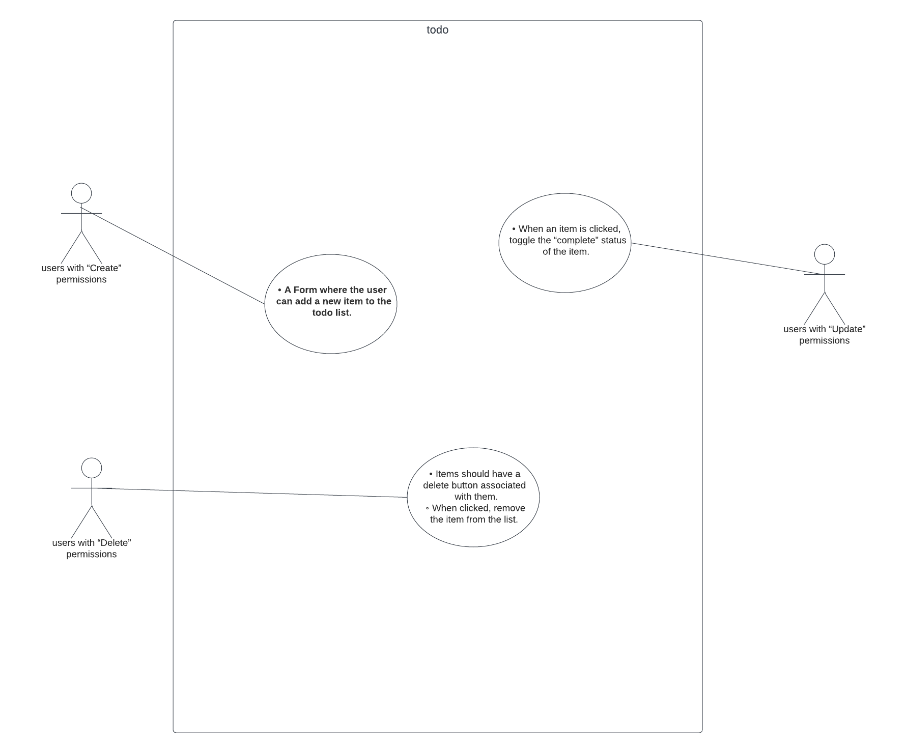

# Lab 33 & Lab 34
Authors: Sham Al-Jalam

A Web Application for securely managing a To Do List.
I added the functionality of updating the display of the completed tasks, the settings of the number of page to display, and the sort keyword, and i added the data to the local storage. and in today's and yesterday's lab  i added a log in and an authentication system that allows user to do tasks based on their roles.

-Note: for the backend side i used my API that i have built from Lab 08 [https://auth-api-ylcl.onrender.com](https://auth-api-ylcl.onrender.com)
## URLs

* deployed application : [https://tangerine-nougat-187c24.netlify.app/](https://tangerine-nougat-187c24.netlify.app/)

* Github actions: [https://github.com/ShamAhmad2022/todo-app/actions](https://github.com/ShamAhmad2022/todo-app/actions)

*  pull request: [https://github.com/ShamAhmad2022/todo-app/pull/3](https://github.com/ShamAhmad2022/todo-app/pull/3)

### Setup:
run: `npm i`

#### users:
here are some users you can try to log in with:

- an Admin user that has all the capabilities:

    - username: sham
    - password: s123

- an regular user that has only the read capability:

    - username: Liam
    - password: s123
    
### Running the app:
* npm start

### Test:
* Unit Test: npm test

### Describe how global state is consumed by the components.
the global state can be reach from anywhere in the project by the 'settingsContext' like this :
settings.(the name of the state)

### Describe the operation of the hook: useForm().
The useForm hook is a custom hook in React that is used to simplify form handling. It abstracts away the common logic for managing form input fields, handling form submission

### UML

